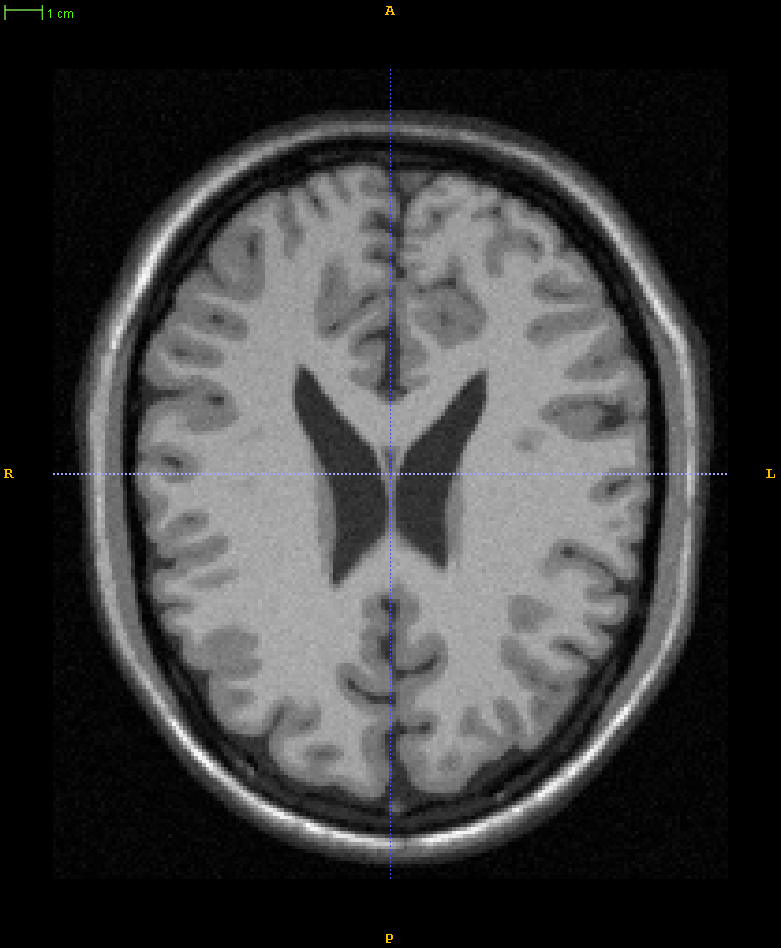
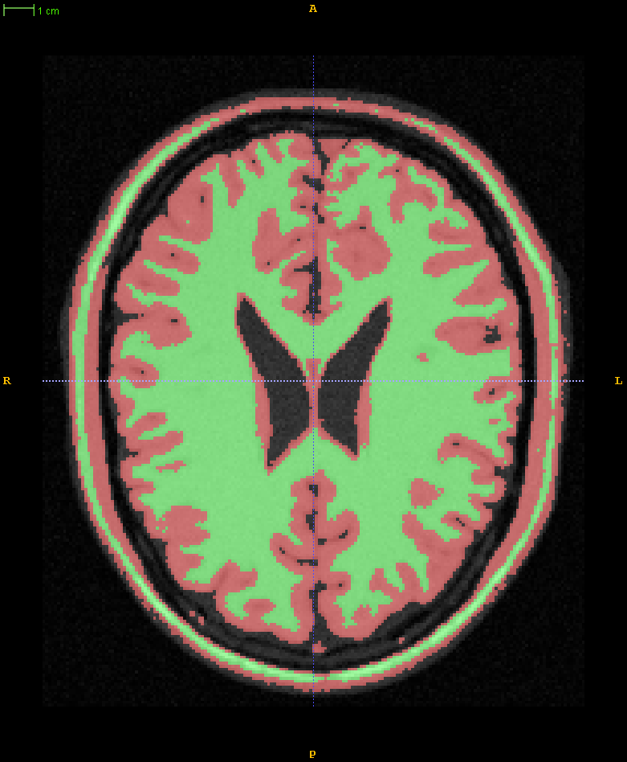
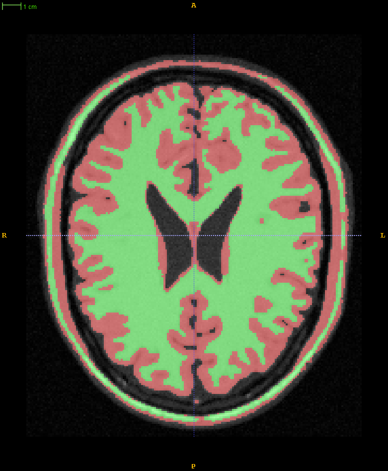

# Bayesian-Image-Label-Correction
Refining labeled images using Bayesian classifier, i.e., adjacent pixels are likely to be of the same class.

The method would be particularly useful in adjusting manual segmented labels and fine tuning machine learning segmented labels.

This repository is inspired ITK [Bayesian segmentation](http://insight-journal.org/browse/publication/69) and [Markov Random Field](https://itk.org/Doxygen/html/classitk_1_1MRFImageFilter.html) method. A membership image with pixel values indicates the Gaussian density functions centered around 'n' pixel intensity values of the input image is generated via K-means and predefined number of classes. The behavior is known as Gaussian mixture model of input image. The membership image is then weighted by user defined label image undergoing Gaussian blur. 

The new membership image is a vector image with same number of components as the number of labels in the user defined label. Through varying the variance of Gaussian blurring and label weight. The pixel value of the vector image represents membership of the n-th class in the user defined label. Note that the corresponding initialization membership class is automatically chosen to k-mean segmented class with nearest mean value as the label region. The classification is then done by applying maximum decision rule to the weighted membership image.

The output of the filter will give a smoothed label map with pixel values indicating the classes that they belongs to. Currently the method will rearrange the label value if the user defined label values are not consecutive.

## Example Usage
### 2D image
The filter supports PNG, NIFTI and DICOM format. By running the following script in command prompt:

```
.\BayesianFilter.exe -i <2D-data-folder>/BrainT1Slice.nii.gz -l <2D-data-folder>/BrainT1Slice.nii.gz -o <2D-data-folder>/BrainT1Slice_output.nii.gz -c 3 -v 1 -w 0.5
```

<p align="center"> 



</p>

Note: Currently the output labels range are not rescaled for PNG output. Pixel value in output image will be same as value of label class. You may have diffuclty in visualizing the image with typical image viewers.

### 3D image
The filter only supports NIFTI image and label input. By running the following script in command prompt:

```
.\BayesianFilter.exe -i <3D-data-folder>/image.nii.gz -l <3D-data-folder>/label.nii.gz -o <3D-data-folder>output.nii.gz -c 2 -v 1 -w 0.5
```

You can view the output result with [itk-SNAP](http://www.itksnap.org/pmwiki/pmwiki.php)

## Compile
Tested with MSVC 2015, the dependencies are also available on Linux and MacOS.

### Dependency
- CMake
- ITK
- Boost

## Author
Jacky Ko <jackkykokoko@gmail.com>
